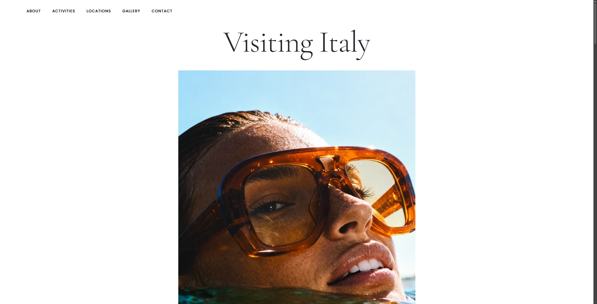

# Visiting Italy - La Dolce Vita

A responsive, magazine-style travel website dedicated to Italian tourism. This project showcases modern web design techniques including CSS Grid/Flexbox layouts, scroll-triggered animations, and custom typography.

## Live Demo
Check out the live website here: [https://ishmaelsanford.github.io/Project4/](https://ishmaelsanford.github.io/Project4/)

## Features
- **Responsive Design:** Adapts seamlessy to mobile, tablet, and desktop screens.
- **Scroll Animations:** Elements fade and slide in as you scroll using the Intersection Observer API.
- **Interactive Elements:** Includes a contact form with validation and a cookie consent banner.
- **Modern Layouts:** Utilizes Bento grids and magazine-style layouts for a unique visual experience.

## Project Details
- **Author:** Ishmael Sanford
- **Course:** ET710 - Web Development
- **Date:** February 2026
